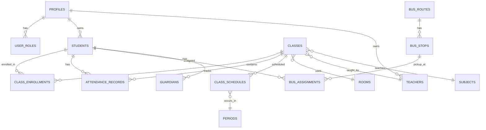
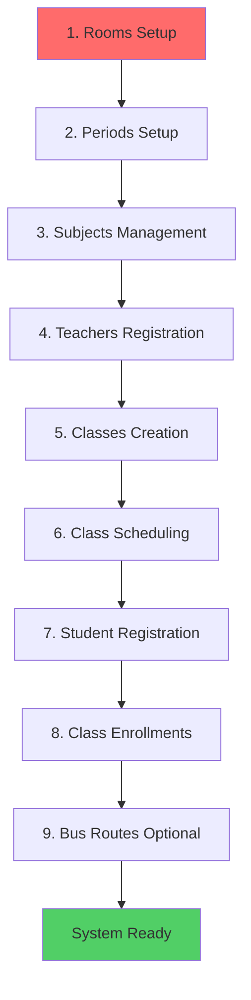
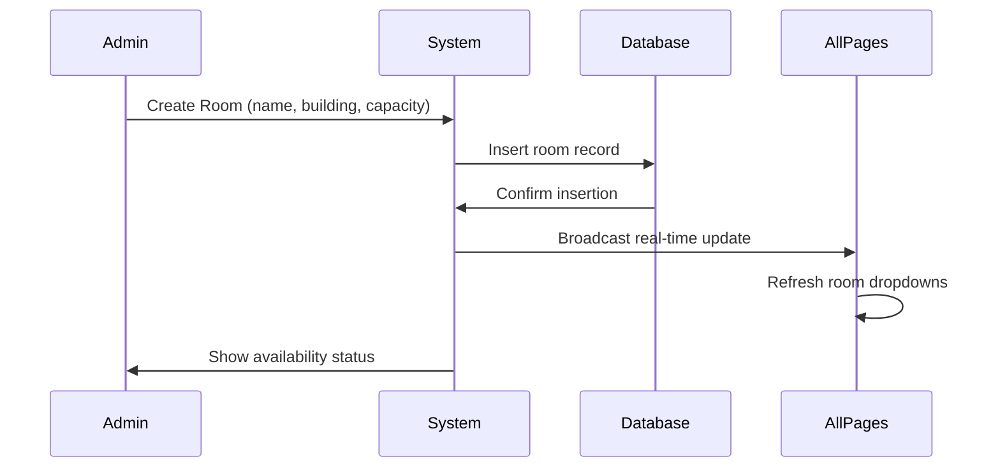
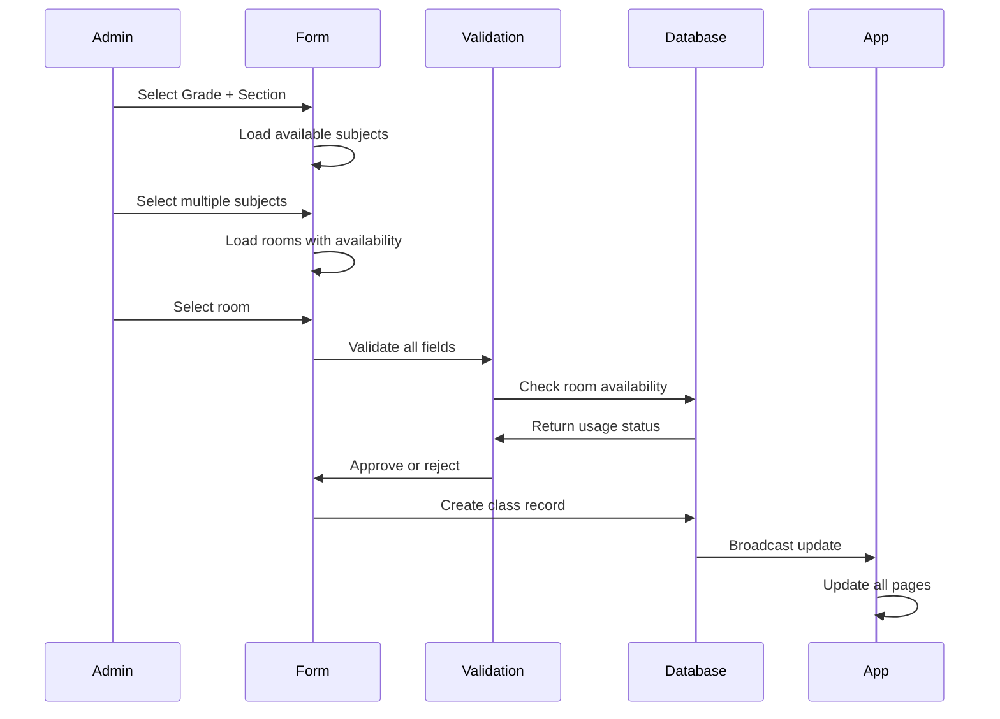
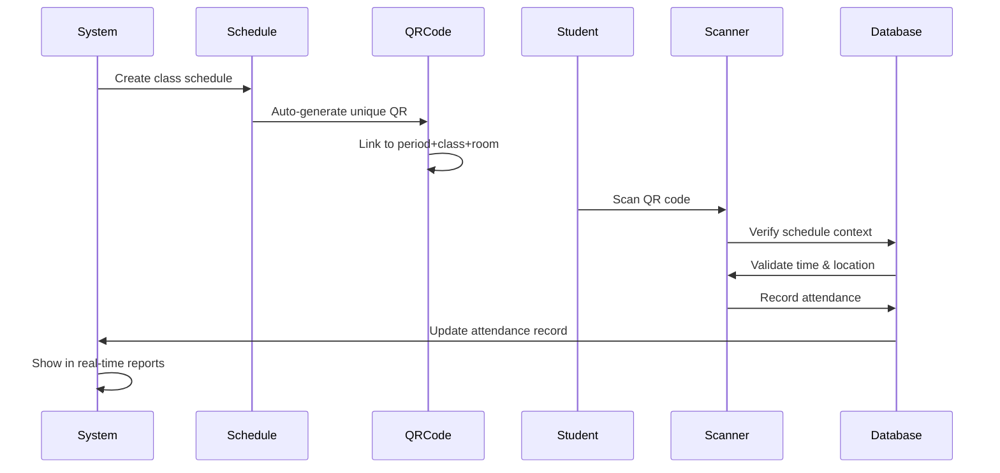
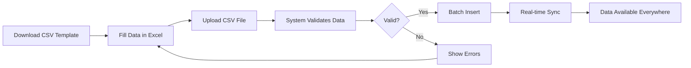

# School Management System - Complete Documentation

## Table of Contents
1. [Overview](#overview)
2. [Key Features](#key-features)
3. [System Architecture](#system-architecture)
4. [User Roles](#user-roles)
5. [Setup Flow](#setup-flow)
6. [Core Processes](#core-processes)
7. [Feature Breakdown](#feature-breakdown)
8. [Best Practices](#best-practices)
9. [Technical Stack](#technical-stack)

---

## Overview

The School Management System is a comprehensive web application designed to streamline school administration, attendance tracking, class scheduling, and student management. Built on modern web technologies, it provides real-time synchronization, automated workflows, and intuitive interfaces for administrators, teachers, and staff.

### What Problem Does It Solve?

- **Manual Attendance Tracking**: Eliminates paper-based attendance with QR code scanning
- **Scheduling Conflicts**: Prevents double-booking of rooms and resources
- **Data Fragmentation**: Centralizes all school data in one unified system
- **Communication Gaps**: Provides real-time updates across all users
- **Administrative Overhead**: Automates repetitive tasks with bulk imports and batch operations

---

## Key Features

### 🎯 Best-in-Class Features

1. **Real-Time Synchronization**
   - All changes propagate instantly across the entire application
   - No page refresh needed - updates appear automatically
   - Multi-user concurrent editing support

2. **QR Code Attendance System**
   - Generate unique QR codes for each class schedule
   - Students scan QR codes for instant attendance recording
   - Linked to specific periods, rooms, and teachers
   - Prevents attendance fraud with schedule validation

3. **Centralized Room Management**
   - Single source of truth for all room data
   - Room availability status visible everywhere
   - Prevents double-booking conflicts
   - Tracks room usage across all classes

4. **Bulk Import Capability**
   - CSV template-based imports for classes and schedules
   - Batch student registration
   - Rapid initial setup for large schools

5. **Comprehensive Reporting**
   - Attendance overview dashboards
   - Hourly check-in patterns
   - Weekday attendance analysis
   - Bus route attendance tracking
   - Classroom-specific reports

6. **Smart Data Validation**
   - Age verification (2-20 years for students)
   - Prevents empty fields in critical data
   - Date of birth cannot be in future
   - Room assignment conflict detection

---

## System Architecture

### Technology Stack

**Frontend:**
- React 18 with TypeScript
- Vite for fast development
- Tailwind CSS for styling
- Shadcn/ui component library
- React Router for navigation
- TanStack Query for data management

**Backend:**
- Lovable Cloud (Supabase)
- PostgreSQL database
- Row Level Security (RLS) policies
- Real-time subscriptions
- Edge Functions (serverless)

**Authentication:**
- Supabase Auth
- Email/password authentication
- Role-based access control (RBAC)
- Secure session management

### Database Schema



### Key Tables

- **profiles**: User account information
- **user_roles**: Role assignments (admin, teacher, student, parent)
- **students**: Student records with demographics
- **teachers**: Teacher profiles and subjects
- **classes**: Class definitions (grade, section, subject, room)
- **rooms**: Physical classroom inventory
- **subjects**: Available subjects
- **periods**: Time slots for classes
- **class_schedules**: Weekly class timetable
- **class_enrollments**: Student-class relationships
- **attendance_records**: Attendance tracking
- **bus_routes**: Transportation routes
- **bus_stops**: Stop locations and times
- **bus_assignments**: Student transportation assignments
- **guardians**: Parent/guardian contact information

---

## User Roles

### 1. Admin
**Full system access with permissions to:**
- Manage all rooms, classes, teachers, and students
- Configure schedules and periods
- Set up bus routes and assignments
- View all reports and analytics
- Perform bulk imports
- Manage user accounts

### 2. Teacher
**Teaching-focused permissions:**
- View assigned classes and students
- Record attendance (manual and QR code)
- View student profiles and guardian contacts
- Access classroom schedules
- Generate class reports

### 3. Student
**Limited self-service access:**
- View own attendance records
- View class schedule
- View assigned bus route
- Update personal profile

### 4. Parent
**Guardian monitoring access:**
- View linked student(s) information
- View attendance records
- Receive notifications
- View bus route details

---

## Setup Flow

### Initial System Configuration (Must Follow This Order)



### Why This Order Matters

1. **Rooms First**: All other entities reference rooms. Creating rooms first ensures data integrity.
2. **Periods Second**: Schedules require defined time periods.
3. **Subjects Third**: Classes need subjects to be assigned.
4. **Teachers Fourth**: Classes can be assigned to teachers.
5. **Classes Fifth**: Combines grades, sections, subjects, and rooms.
6. **Schedules Sixth**: Links classes to specific periods and days.
7. **Students Seventh**: Can now be enrolled in existing classes.
8. **Enrollments Eighth**: Connect students to their classes.
9. **Transportation Last**: Optional but depends on student data.

---

## Core Processes

### 1. Room Management Workflow



**Key Benefits:**
- Prevents duplicate room assignments
- Shows usage count (e.g., "3 classes" or "Available")
- Real-time updates across all pages
- Single source of truth

### 2. Class Creation Workflow



**Validation Rules:**
- Grade, section, and at least one subject required
- Room must be selected from available rooms
- Teacher assignment is optional
- No empty strings allowed in critical fields

### 3. QR Code Attendance Process



**Smart Features:**
- QR codes are schedule-specific (not just class-specific)
- Prevents attendance fraud with time validation
- Links to exact period, room, and teacher
- Automatic timestamp recording

### 4. Bulk Import Process



**Supported Imports:**
- Classes (grade, section, subjects, rooms)
- Classroom setup (bulk schedule creation)
- Students (via registration forms)

---

## Feature Breakdown

### 📊 Dashboard & Reports

**Purpose**: Centralized analytics and insights

**Components:**
1. **Dashboard Stats**
   - Total students enrolled
   - Active classes count
   - Today's attendance rate
   - Active bus routes

2. **Attendance Charts**
   - Daily attendance trends
   - Hourly check-in patterns
   - Weekday comparison
   - Monthly summaries

3. **Quick Actions**
   - Shortcuts to common tasks
   - Recent activity feed
   - Notifications center

**Benefits:**
- Data-driven decision making
- Identify attendance patterns
- Spot issues early
- Monitor system health

### 👨‍🎓 Student Management

**Capabilities:**
- Complete student profiles
- Medical information (blood type, allergies)
- Guardian contact management
- Photo uploads to secure storage
- Bus assignment tracking
- Class enrollment history

**Validation:**
- Age must be 2-20 years
- Student code uniqueness
- Date of birth cannot be future
- At least one guardian required

**Security:**
- Photos stored in encrypted Supabase storage
- RLS policies protect student data
- Only authorized roles can view/edit

### 👨‍🏫 Teacher Management

**Features:**
- Teacher profiles with contact info
- Subject specialization tracking
- Class assignments
- Teacher codes for identification
- Optional user account linking

**Workflow:**
- Admin creates teacher profile
- Assigns subjects and specializations
- Links to classes as needed
- Teacher can log in and access assigned classes

### 🚌 Transportation Management

**Bus Route System:**
- Route codes and names
- Driver information
- Departure/return times
- Status tracking (active/inactive)

**Bus Stops:**
- Stop names and locations
- Arrival times
- Stop order sequencing
- Route associations

**Student Assignments:**
- Link students to routes and stops
- Track assignment history
- Status management
- Easy reassignment

### 📅 Schedule Management

**Period Configuration:**
- Define time slots (e.g., Period 1: 8:00-8:50)
- Numbered periods for easy reference
- Used across all schedules

**Class Schedules:**
- Weekly timetable creation
- Day-specific assignments
- Period-specific assignments
- Week number support (for rotating schedules)
- Auto-generated QR codes per schedule

**Cascading Dropdown Workflow:**
1. Select Grade
2. Select Section
3. Select Subject
4. Select Room (with availability)
5. Assign to Period & Day

### ✅ Attendance System

**Recording Methods:**
1. **QR Code Scanning** (Recommended)
   - Student scans schedule-specific QR
   - Automatic timestamp and location
   - Fraud prevention built-in

2. **Manual Entry**
   - Teacher marks present/absent
   - Add notes for special cases
   - Bulk update support

**Attendance Reports:**
- Individual student history
- Class-wide summaries
- Date range filtering
- Export capabilities

### 🏛️ Room Management

**Room Database:**
- Room name (unique identifier)
- Building location
- Floor number
- Capacity limits

**Smart Features:**
- **Availability Status**: Shows "Available" or usage count
- **Real-time Updates**: Changes sync everywhere instantly
- **Conflict Prevention**: See which classes use which rooms
- **Centralized Management**: Single source of truth

**Integration Points:**
- Class creation form
- Schedule management
- Bulk imports
- Reports and analytics

---

## Best Practices

### For Administrators

1. **Always Set Up Rooms First**
   - Complete the Rooms section before anything else
   - Add all physical classrooms to the system
   - Include building and capacity information

2. **Use Bulk Imports for Efficiency**
   - Download CSV templates
   - Prepare data in Excel/Sheets
   - Import multiple classes or schedules at once

3. **Enable Auto-Confirm Email**
   - Go to Settings → Authentication
   - Enable auto-confirm for testing
   - Disable in production for security

4. **Regular Data Cleanup**
   - Use the Data Cleanup tool (Admin tab)
   - Fix empty subject or room fields
   - Maintain data integrity

5. **Monitor Room Usage**
   - Check room availability status regularly
   - Prevent overcrowding with capacity limits
   - Reassign classes if conflicts arise

### For Teachers

1. **Use QR Codes for Attendance**
   - Faster than manual entry
   - More accurate timestamps
   - Reduces human error

2. **Review Schedules Weekly**
   - Verify correct room assignments
   - Check for schedule changes
   - Note any conflicts

3. **Keep Guardian Contacts Updated**
   - Essential for emergencies
   - Validate phone numbers
   - Ensure primary guardian is marked

### For Students

1. **Always Scan QR Codes**
   - Don't ask others to scan for you
   - Scan at the start of class
   - Verify successful scan

2. **Check Schedule Regularly**
   - Room changes happen
   - Teacher substitutions occur
   - Bus route modifications

---

## Pros & Advantages

### 🚀 Performance
- Real-time updates eliminate page refreshes
- Fast data loading with optimized queries
- Scalable architecture handles growing schools

### 🔒 Security
- Row Level Security (RLS) on all tables
- Role-based access control
- Encrypted data storage
- Secure authentication

### 🎨 User Experience
- Clean, modern interface
- Intuitive navigation
- Mobile-responsive design
- Consistent design system

### 🔧 Maintainability
- Single source of truth for data
- Automated synchronization
- Built-in data validation
- Easy bulk operations

### 💰 Cost-Effective
- Cloud-based (no server maintenance)
- Usage-based pricing
- Free tier for testing
- Scales with your needs

### 📈 Scalability
- Handles small to large schools
- Multi-campus support ready
- Concurrent user support
- Growing feature set

---

## Technical Stack Details

### Frontend Technologies
```
React 18.3.1          - UI framework
TypeScript            - Type safety
Vite                  - Build tool
Tailwind CSS 3.x      - Styling
Shadcn/ui             - Component library
React Router 6.26.2   - Navigation
TanStack Query 5.x    - Data fetching
React Hook Form       - Form management
Zod                   - Schema validation
Recharts 2.12.7       - Data visualization
React QR Code         - QR generation
Date-fns              - Date utilities
Lucide React          - Icons
Sonner                - Toast notifications
```

### Backend Technologies
```
Lovable Cloud (Supabase)
├── PostgreSQL 13+    - Database
├── Auth              - Authentication
├── Storage           - File uploads
├── Real-time         - Live updates
└── Edge Functions    - Serverless logic
```

### Key Dependencies
```json
{
  "@supabase/supabase-js": "^2.81.0",
  "@tanstack/react-query": "^5.56.2",
  "react-hook-form": "^7.53.0",
  "react-router-dom": "^6.26.2",
  "recharts": "^2.12.7",
  "zod": "^3.23.8"
}
```

---

## Integration Points

### Authentication Flow
```typescript
// User signs up
supabase.auth.signUp({
  email: 'user@school.com',
  password: 'secure-password',
  options: {
    emailRedirectTo: `${window.location.origin}/`
  }
})

// Profile auto-created via trigger
// Role assigned by admin
// User logs in and accesses features
```

### Real-Time Subscriptions
```typescript
// Example: Listen to room changes
supabase
  .channel('rooms-changes')
  .on('postgres_changes', {
    event: '*',
    schema: 'public',
    table: 'rooms'
  }, (payload) => {
    // Update UI automatically
    loadRooms();
  })
  .subscribe();
```

### Data Validation Example
```typescript
// Student age validation
const age = differenceInYears(new Date(), dateOfBirth);
if (age < 2 || age > 20) {
  throw new Error('Student age must be between 2-20 years');
}
```

---

## Future Enhancement Opportunities

1. **Mobile App**: Native iOS/Android apps
2. **Parent Portal**: Dedicated parent dashboard
3. **SMS Notifications**: Attendance alerts via SMS
4. **Grade Management**: Academic performance tracking
5. **Library System**: Book checkout integration
6. **Fee Management**: Payment processing
7. **Exam Scheduling**: Test calendar and results
8. **Resource Booking**: Lab/equipment reservations
9. **Communication Hub**: Announcements and messaging
10. **Analytics AI**: Predictive attendance insights

---

## Support & Resources

- **Documentation**: You're reading it!
- **System Settings**: Available in Settings page
- **Data Export**: Export tables from Cloud → Database
- **Backup**: Automatic daily backups via Lovable Cloud
- **Updates**: Check for new features in Settings → About

---

## Conclusion

The School Management System provides a comprehensive, modern solution for educational institutions. With its real-time capabilities, intelligent automation, and user-friendly design, it streamlines administrative tasks and enables better decision-making through data insights.

**Key Takeaway**: The system's architecture ensures that Rooms serve as the foundational data source, with all other features building upon this centralized, real-time infrastructure.

---

*Last Updated: 2025*
*Version: 1.0*
